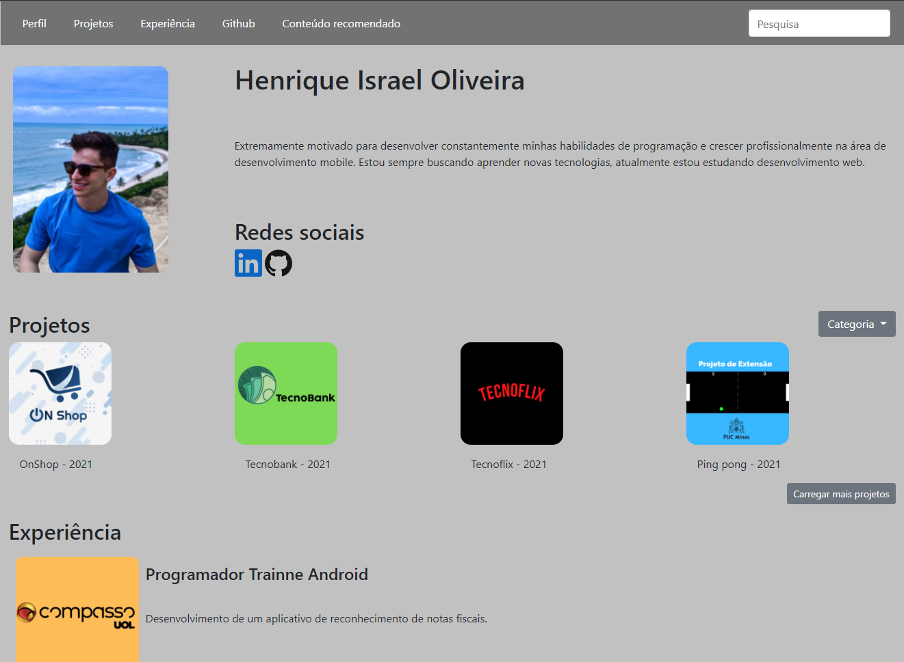
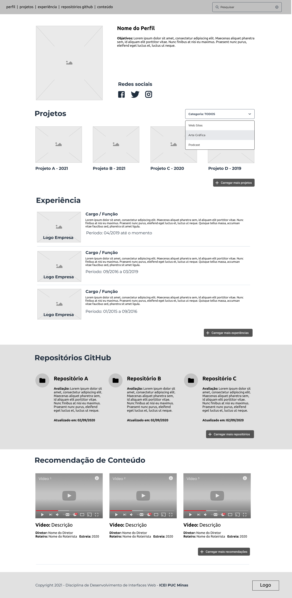

<h1 align="center">Site Pessoal - Desenvolvimento de Interfaces Web</h1>

 

<h3 align="center">
  
</h3>

<h2> Sobre </h2>

Esse é meu primeiro projeto desenvolvido para a disciplina de Desenvolvimento de Interfaces Web na PUC Minas. O objetivo do trabalho foi a construção de um site pessoal de acordo com o wireframe a seguir: 

 

<h2>Conclusão</h2>

Nesse projeto aprendi um pouco mais sobre o desenvolvimento web e implementar a responsividade utilizando o framework bootstrap.

